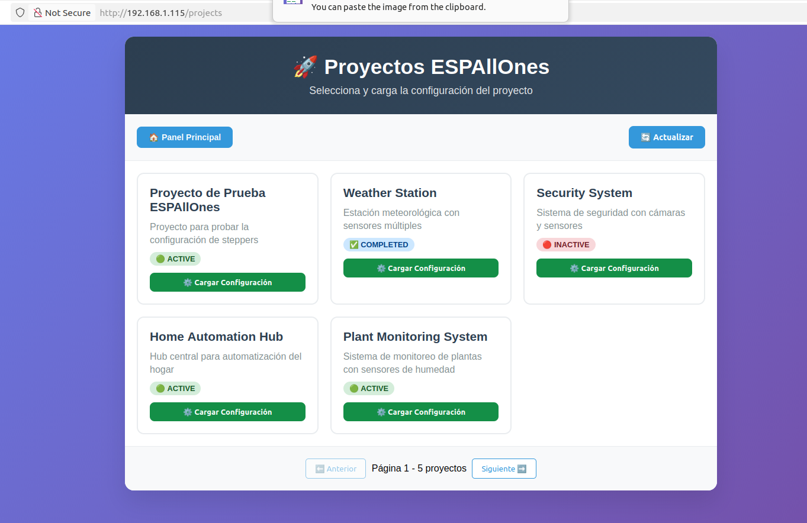
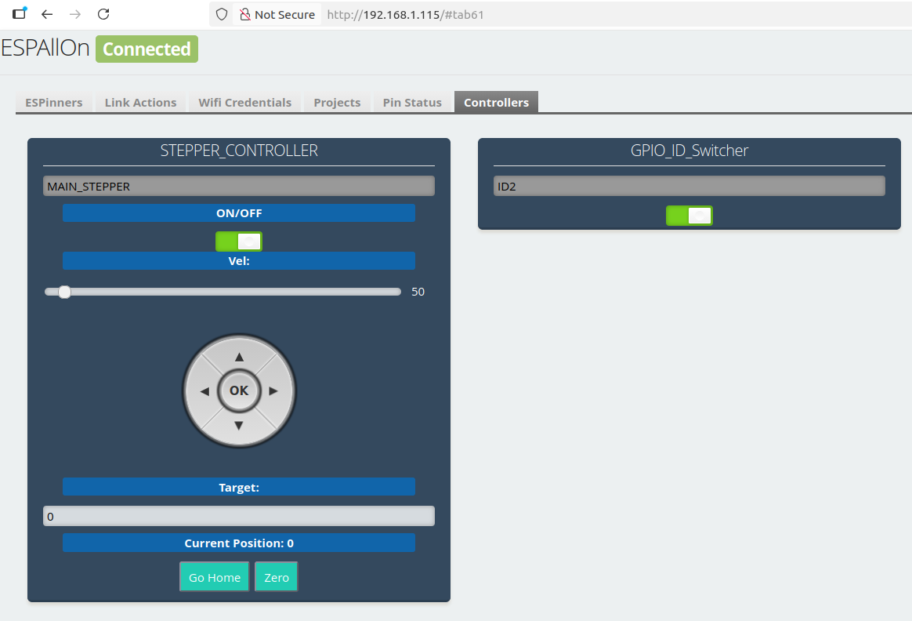
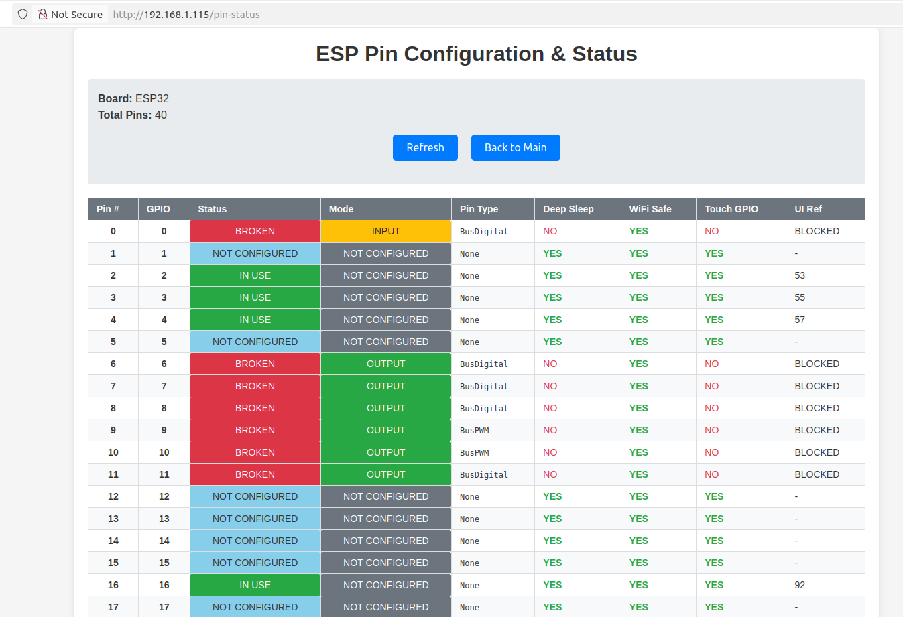

# 🚀 ESPAllOn - Plataforma Educativa para Proyectos IoT

**ESPAllOn** es una plataforma educativa diseñada específicamente para adolescentes que quieren desarrollar proyectos de Internet de las Cosas (IoT) sin necesidad de conocimientos avanzados en programación. Con una interfaz web intuitiva, permite configurar y controlar dispositivos ESP32/ESP8266 de forma visual y sencilla.
Con una interfaz web intuitiva, transforma tu ESP en un sistema configurable y reutilizable para múltiples aplicaciones.

## 🎯 ¿Qué es ESPAllOn?

ESPAllOn funciona como un **modelo genérico** que:

1. Se conecta a una **base de datos externa** de proyectos
2. Descarga configuraciones predefinidas con un **solo click**
3. Configura automáticamente pines, componentes y controladores
4. Está listo para ejecutar el proyecto sin reprogramar el ESP

## 🌟 Características Principales

> **Piensa en ello**: Un ESP → Múltiples proyectos. Sin necesidad de recompilar código.

### 🔧 Customiza e integra tus Módulos (ESPinners)


El sistema incluye módulos predefinidos para los componentes más comunes:

- **GPIO**: Entradas y salidas digitales básicas
- **Stepper**: Motores paso a paso con múltiples drivers (TMC2208, TMC2209, A4988, etc.)
- **DC Motor**: Motores de corriente continua con control de dirección
- **NeoPixel**: Tiras de LEDs direccionables
- **RFID**: Lectores de tarjetas RFID
- **MPU**: Sensores de movimiento (acelerómetro/giroscopio)
- **Encoder**: Encoders rotativos

### 1. **Conéctate a la Base de Datos**

El ESP se conecta a un servidor remoto (`https://espallon.blascarr.com`) donde están almacenados los proyectos disponibles.



### 2. **Selecciona un Proyecto**

Desde la interfaz web, navegas por proyectos ya predefinidos. Haz click en el botón de Cargar Proyecto y ...

### 3. **Carga con Un Click**

El sistema descarga la configuración JSON y automáticamente:

- Configura los pines necesarios
- Crea los módulos (ESPinners) requeridos
- Genera controladores para la interfaz
- Inicializa sensores y actuadores

### 4. **Listo para Usar**

Tu proyecto está funcionando. Puedes controlarlo desde cualquier navegador.

### 3. **Control Remoto**



## 🧩 Módulos (ESPinners)

### 4. **Importación de Proyectos**

- Navega a la sección "Proyectos"
- Selecciona un proyecto desde la biblioteca online
- Carga la configuración con un solo clic
- ¡Tu proyecto está listo para usar!

### Estado de Pines

Visualiza en tiempo real el estado de todos los pines del ESP: configuración, modo, tipo, y uso.



### Control Dinámico

Cada proyecto genera automáticamente su interfaz de control adaptada a los componentes configurados.

## 🛠️ Instalación Rápida

### Requisitos

- **Hardware**: ESP32 o ESP8266
- **Software**: PlatformIO IDE
- **Conectividad**: Red WiFi

### Setup

```bash
# 1. Clona el repositorio
git clone https://github.com/yourusername/ESPAllOn.git

```

Abre el proyecto con Platformio, selecciona el tipo de placa que vas a usar.
Y sube el firmware

Conectate a la Wifi de tu dispositivo y configura tu red.

- Si quieres, puedes introducir tu red dentro del archivo de config.h e introducir las credenciales de tu red \*

## 🎓 Valor Educativo

### En el Aula para Educadores y Estudiantes

- **Servidor de proyectos**: `https://espallon.blascarr.com`
- **Biblioteca de configuraciones**: Proyectos predefinidos
- **Actualizaciones automáticas**: Nuevos módulos y funcionalidades

Interfaz más rápida, ideal para producción.

---

**ESPAllOn** - Haciendo la programación IoT accesible para todos 🎓✨

_¿Listo para cargar tu primer proyecto? Conecta y haz click._
